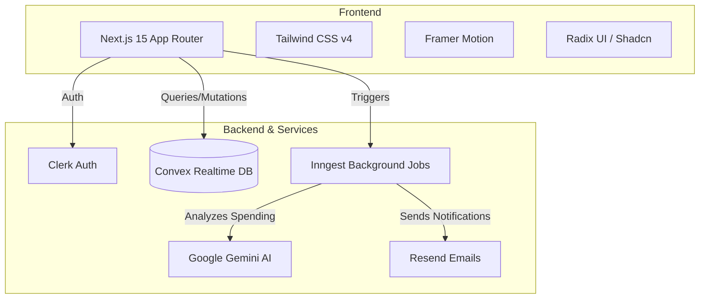

# Treqo 
> A modern, AI-powered expense tracking and bill-splitting application built with the latest web technologies.

Treqo makes managing shared expenses effortless. With intelligent Gemini-based notifications and seamless background processing powered by Inngest, keeping track of detailed spending with friends, family, or roommates has never been easier.

---

## Features

- **Smart Bill Splitting:** Easily split expenses evenly, by percentage, or custom amounts.
- **AI-Powered Insights:** Uses **Google Gemini AI** to provide detailed spending breakdowns and personalized financial insights.
- **Automated Notifications:** **Inngest** and **Resend** handle intelligent background notifications so you never miss a pending settlement.
- **Real-time Sync:** Powered by **Convex** for real-time data synchronization.
- **Secure Authentication:** User management and authentication handled seamlessly by **Clerk**.
- **Beautiful UI:** Built with **TailwindCSS 4**, **Framer Motion**, and accessible Radix UI components.

---

## Architecture & Tech Stack



### Stack Details
- **Framework:** Next.js 15 (App Router, Turbopack)
- **Styling:** Tailwind CSS 4, Framer Motion
- **UI Components:** Shadcn UI (Radix Primitives)
- **State Management:** Zustand
- **Database / Backend:** Convex
- **Authentication:** Clerk
- **Background Jobs:** Inngest
- **AI / LLM:** Google Generative AI (Gemini)
- **Email:** Resend
- **Validation:** Zod + React Hook Form

---

## Folder Structure

```text
treqo/
├── app/                     # Next.js App Router
│   ├── api/                 # API routes (Inngest webhooks, etc.)
│   ├── (auth)/              # Clerk authentication pages (sign-in, sign-up)
│   ├── dashboard/           # Main application dashboard
│   ├── layout.js            # Root layout including providers
│   └── page.js              # Landing page
├── components/              # UI Components
│   ├── ui/                  # Radix UI / Shadcn primitives (buttons, dialogs)
│   ├── layout/              # Navbars, sidebars, and footers
│   └── features/            # Domain-specific components (e.g., SplitBillForm)
├── convex/                  # Convex Database & Backend
│   ├── schema.js            # Database schema definition
│   ├── queries.js           # Read operations
│   └── mutations.js         # Write operations
├── hooks/                   # Custom React hooks (e.g., useMediaQuery)
├── lib/                     # Utility functions
│   ├── utils.js             # Shared helpers (e.g., tailwind-merge, clsx)
│   ├── gemini.js            # Google Generative AI integration logic
│   └── inngest/             # Background job and event definitions
├── public/                  # Static assets (images, fonts, icons)
├── middleware.js            # Next.js middleware (Clerk route protection)
├── components.json          # Shadcn UI configuration
├── tailwind.config.js       # Tailwind CSS configuration
└── package.json             # Project dependencies and scripts
```

---

## Live Demo

Check out the deployed application here: **[https://treqocom.vercel.app](https://treqocom.vercel.app)**

---

## Support the Project
If you found this project helpful, please consider leaving a ⭐️ **GitHub Star**! It helps the project grow and motivates the development of new features!
